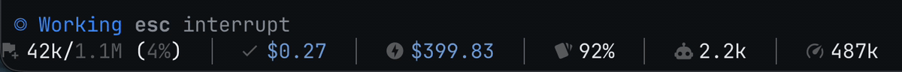
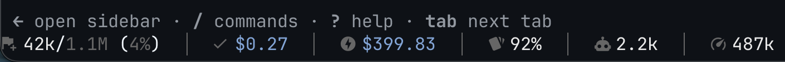

# copilot-powerline

[](https://github.com/xpepper/copilot-powerline/actions/workflows/ci.yml)
[](https://crates.io/crates/copilot-powerline)
[](https://opensource.org/licenses/MIT)

> **A fast, beautiful status line for GitHub Copilot CLI.**
>
> Keep context usage, session and monthly spend, prompt-cache efficiency, reasoning tokens, and total session activity visible while you work. `copilot-powerline` is a native Copilot CLI `statusLine` command: a small Rust executable with bundled SQLite that reads the data Copilot already provides.

## Install and connect it to Copilot CLI

Install from crates.io:

```bash
cargo install copilot-powerline
```

Then add it to `~/.copilot/settings.json`:

```json
{
  "statusLine": {
    "type": "command",
    "command": "copilot-powerline",
    "refreshInterval": 30
  }
}
```

If Cargo's bin directory is not on your `PATH`, use `~/.cargo/bin/copilot-powerline` as the command. Run `copilot-powerline --init` at any time to create the default configuration at `~/.copilot/powerline.toml`.

## See it in action



<details>
<summary>View a static status-line preview</summary>


</details>

```text
⚠️ 145k/400k (36%)  │  󰄬 $8.64  │  󰠠 $281.66  │  󰘸 95%  │  󰚩 6.2k  │  󰓅 4.5M
```

Text preview: a Copilot CLI status line showing a context warning, current-session and month-to-date spend, prompt-cache hit rate, reasoning tokens, and total session tokens.

Choose the presentation that fits your terminal:

```text
# Minimal (Nerd icons)
󰮚 129k/400k (32%)  │  󰄬 $2.20  │  󰠠 $273.88  │  󰘸 80%  │  󰚩 4.2k  │  󰓅 175k

# Capsule (Nerd icons)
󰮚 129k/400k (32%)  󰄬 $2.20  󰠠 $273.88  󰘸 80%  󰚩 4.2k  󰓅 175k 

# Plain (text labels)
Tokens: 129k/400k (32%)  │  Session: $2.20  │  Month: $273.88  │  Cache: 80%  │  Think: 4.2k  │  Total: 175k
```

## Why copilot-powerline?

- **Stay in flow.** See context pressure before it becomes disruptive, with configurable warnings and a choice of compact layouts.
- **Understand usage.** Follow session spend, month-to-date spend, cache hits, reasoning tokens, and total token volume in the terminal.
- **Make it yours.** Select `minimal`, `powerline`, `capsule`, or `plain` layouts; `nerd`, `emoji`, or text icons; and a built-in color theme.
- **Keep it lightweight.** A compiled Rust executable runs as Copilot refreshes the native status line and queries Copilot's local session database read-only.

Inspired by [`claude-powerline`](https://github.com/Owloops/claude-powerline).

---

## Features

- **Context Window Monitoring**: Real-time context tracking with percentage and warning alert threshold (`>100k`).
- **Prompt Cache Tracking**: Real-time cache hit rate (or token count), automatically hidden when zero.
- **Reasoning Tokens**: Tracks thinking tokens for reasoning models (e.g. o3-mini, Claude 3.7 Sonnet thinking).
- **Total Session Tokens**: Displays total accumulated token volume across all turns and compactions.
- **Spend Tracking**: Real-time session spend and month-to-date aggregation from Copilot's local SQLite database.
- **Configurable AIC Display**: Toggle whether AI Credits (`... AIC`) appear alongside dollar amounts.
- **Multiple Styles & Icon Sets**: Choose from `minimal`, `powerline`, `capsule`, or `plain`, with `nerd`, `emoji`, or `plain` icons.
- **Themes**: Built-in support for `colorblind`, `github`, `nord`, `tokyo-night`, and `plain`. Automatically syncs with your Copilot CLI theme if set to default.
- **Bundled SQLite**: SQLite and JSON parsing ship with the executable; no status-line service is required.

---

## Installation and compatibility

### Recommended: install with Cargo

The [quick start](#install-and-connect-it-to-copilot-cli) uses the supported installation path:

```bash
cargo install copilot-powerline
```

It requires a current stable Rust toolchain with Cargo. The installed executable runs locally during Copilot CLI status-line refreshes and makes no network requests.

### Verified environments and terminal support

CI tests and builds release binaries on GitHub Actions' current macOS and Ubuntu runner images. Other platforms are not currently verified in CI.

The default `nerd` icon set requires a [Nerd Font](https://www.nerdfonts.com/). Use `--icon-set emoji` or `--icon-set plain` when your terminal does not support Nerd Font glyphs.

### Build from source

For local development or unreleased changes:

```bash
git clone https://github.com/xpepper/copilot-powerline.git
cd copilot-powerline
cargo install --path .
```

To configure a generated default, run:

```bash
copilot-powerline --init
```

This creates `~/.copilot/powerline.toml`.

---

## Experimental: exact GitHub usage refresh

The `month_cost` segment calculates an estimate from the local Copilot CLI
database. GitHub's **Settings > Copilot > Features** page can show a more
complete personal usage counter, including usage that is absent from the local
database.

The experimental helper fetches that displayed counter through a dedicated
local browser profile. It never sends the profile or cookies anywhere, and it
does not run as part of the status-line refresh loop.

```bash
# Install the browser dependency once.
npm install --global agent-browser
agent-browser install

# Open a visible browser once and complete GitHub login, SSO, and 2FA.
./scripts/fetch-github-copilot-usage --login

# Fetch the current value and save a private local cache.
./scripts/fetch-github-copilot-usage
# {"ai_credits_used":49854,"usd":"498.54","cycle":"September 1-30, 2026"}
```

By default, browser state is stored in
`~/.copilot/github-usage-profile` and the output cache in
`~/.copilot/github-usage.json`. Set `COPILOT_USAGE_BROWSER_PROFILE` or
`COPILOT_USAGE_CACHE_FILE` to use different paths. The helper depends on an
undocumented GitHub settings page and may need updating if GitHub changes its
markup.

---

## Status Line Legend & Segments

| Segment | Icon (`nerd`) | Icon (`emoji`) | Text (`plain`) | Example Value | Description |
|---|:---:|:---:|---|---|---|
| `tokens` | `󰮚` / `⚠️` | `🪙` / `⚠️` | `Tokens:` | `145k/400k (36%)` | **Context Window**: Active context tokens vs model limit (and percentage used). Automatically switches to `⚠️` when crossing the configured alert threshold (default `>100k`). |
| `session_cost` | `󰄬` | `💰` | `Session:` | `$8.64` | **Current Session Cost**: Real-time spend accumulated in the active session in USD (optional AIC credit display). |
| `month_cost` | `󰠠` | `📅` | `Month:` | `$281.66` | **Month-to-Date Cost**: Total cumulative monthly spend across all sessions, queried directly from Copilot's `~/.copilot/session-store.db`. |
| `cache` | `󰘸` | `⚡` | `Cache:` | `95%` | **Prompt Cache Hit Rate**: Percentage of prompt tokens served from cache (or raw token count). Automatically hidden when 0. |
| `reasoning` | `󰚩` | `🧠` | `Think:` | `6.2k` | **Reasoning Tokens**: Cumulative tokens used by thinking models (e.g. o3-mini, Claude 3.7 Sonnet). Automatically hidden when 0. |
| `total_tokens` | `󰓅` | `📊` | `Total:` | `4.5M` | **Total Session Tokens**: Total cumulative token throughput (input + output + cached) exchanged across all turns and compactions in the session. |

---

## Configuration (`~/.copilot/powerline.toml`)

`copilot-powerline` is configured via a simple TOML file:

```toml
style = "minimal"      # Options: "minimal", "powerline", "capsule", "plain"
icon_set = "nerd"      # Options: "nerd", "emoji", "plain"
theme = "colorblind"   # Options: "colorblind", "github", "nord", "tokyo-night", "plain"
segments = [
    "tokens",
    "session_cost",
    "month_cost",
    "cache",
    "reasoning",
    "total_tokens",
]

[tokens]
enabled = true
show_percentage = true
alert_threshold = 100000
alert_icon = "⚠️ "
# prefix = "Tokens:"   # Optional custom override

[session_cost]
enabled = true
currency_symbol = "$"
show_aic = false       # Set to true to show "(X.X AIC)"
decimal_places = 2

[month_cost]
enabled = true
currency_symbol = "$"
show_aic = false       # Set to true to show "(X AIC)"
decimal_places = 2

[cache]
enabled = true
show_as_percentage = true  # Set to false to show token count (e.g. 85k)
auto_hide_zero = true      # Automatically hide if 0 cache reads

[reasoning]
enabled = true
auto_hide_zero = true      # Automatically hide if model has no reasoning tokens

[total_tokens]
enabled = true
```

---

## Command Line Options

```bash
# Test with sample JSON from stdin
echo '{"context_window":{"current_context_tokens":0,"displayed_context_limit":200000,"current_context_used_percentage":0},"ai_used":{"total_nano_aiu":0}}' | copilot-powerline

# Override icon set on the fly
copilot-powerline --icon-set nerd
copilot-powerline --icon-set emoji
copilot-powerline --icon-set plain

# Override style on the fly
copilot-powerline --style capsule
copilot-powerline --style powerline
copilot-powerline --style minimal

# Override theme on the fly
copilot-powerline --theme nord
copilot-powerline --theme tokyo-night

# Use a custom configuration file
copilot-powerline --config /path/to/custom-powerline.toml
```

---

## Troubleshooting

- **Icons look like question marks or boxes?**
  Make sure your terminal font is a [Nerd Font](https://www.nerdfonts.com/) (such as *JetBrainsMono Nerd Font*, *Hack Nerd Font*, or *FiraCode Nerd Font*). Alternatively, switch to emoji icons by setting `icon_set = "emoji"` or plain text with `icon_set = "plain"` in `powerline.toml`.

- **Copilot shows a blank statusline?**
  Ensure `copilot-powerline` is in your `PATH` or use the full path `~/.cargo/bin/copilot-powerline` in `~/.copilot/settings.json`.

---

## Contributing

Contributions are welcome. See [CONTRIBUTING.md](CONTRIBUTING.md) for local setup, verification commands, supported scope, and the pull-request workflow.

---

## License

MIT
