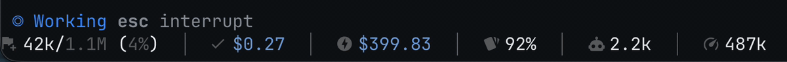
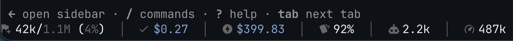

# copilot-powerline

[](https://github.com/xpepper/copilot-powerline/actions/workflows/ci.yml)
[](https://crates.io/crates/copilot-powerline)
[](https://opensource.org/licenses/MIT)

> **A fast, beautiful status line for GitHub Copilot CLI.**
>
> Keep context usage, session and monthly spend, prompt-cache efficiency, reasoning tokens, and total session activity visible while you work. `copilot-powerline` is a native Copilot CLI `statusLine` command: a small Rust executable with bundled SQLite that reads the data Copilot already provides.

## Install and connect it to Copilot CLI

Install a prebuilt binary (macOS and Linux, no Rust toolchain needed):

```bash
curl --proto '=https' --tlsv1.2 -LsSf https://github.com/xpepper/copilot-powerline/releases/latest/download/copilot-powerline-installer.sh | sh
```

Or with Homebrew:

```bash
brew install xpepper/tap/copilot-powerline
```

Or install from crates.io:

```bash
cargo install copilot-powerline
```

Then add it to `~/.copilot/settings.json`:

```json
{
  "statusLine": {
    "type": "command",
    "command": "copilot-powerline",
    "refreshInterval": 30
  }
}
```

Keep `refreshInterval`: without it Copilot CLI only refreshes the status line on events, so the idle cache-expiry warning (`cache_expiry`) cannot appear while you are away.

If the install directory is not on your `PATH`, use the full path as the command: `~/.local/bin/copilot-powerline` for the installer, or `~/.cargo/bin/copilot-powerline` for Cargo. Run `copilot-powerline --init` at any time to create the default configuration at `~/.copilot/powerline.toml`.

Out of the box the status line uses text labels (`Tokens:`, `Session:`, ...). For the glyphs shown below, set `icon_set = "nerd"` in that file (it needs a [Nerd Font](https://www.nerdfonts.com/)), or `"emoji"`.

## See it in action



<details>
<summary>View a static status-line preview</summary>


</details>

```text
󰮚 🔥 145k/400k (36%)  │  󰄬 $8.64  │  󰠠 $281.66  │  󰘸 95%  │  󰚩 6.2k  │  󰓅 4.5M
```

Text preview: a Copilot CLI status line showing a context warning, current-session and month-to-date spend, prompt-cache hit rate, reasoning tokens, and total session tokens.

Choose the presentation that fits your terminal:

```text
# Minimal (Nerd icons)
󰮚 89k/400k (22%)  │  󰄬 $2.20  │  󰠠 $273.88  │  󰘸 80%  │  󰚩 4.2k  │  󰓅 175k

# Capsule (Nerd icons)
󰮚 89k/400k (22%)  󰄬 $2.20  󰠠 $273.88  󰘸 80%  󰚩 4.2k  󰓅 175k 

# Plain (text labels)
Tokens: 89k/400k (22%)  │  Session: $2.20  │  Month: $273.88  │  Cache: 80%  │  Think: 4.2k  │  Total: 175k
```

## Why copilot-powerline?

- **Stay in flow.** See context pressure before it becomes disruptive, with configurable warnings and a choice of compact layouts.
- **Understand usage.** Follow session spend, month-to-date spend, cache hits, reasoning tokens, and total token volume in the terminal.
- **Make it yours.** Select `minimal`, `powerline`, `capsule`, or `plain` layouts; `nerd`, `emoji`, or text icons; and a built-in color theme.
- **Keep it lightweight.** A compiled Rust executable runs as Copilot refreshes the native status line and queries Copilot's local session database read-only.

Inspired by [`claude-powerline`](https://github.com/Owloops/claude-powerline).

---

## Features

- **Context Window Monitoring**: Real-time context tracking with percentage and warning alert threshold (`>100k`).
- **Prompt Cache Tracking**: Real-time cache hit rate (or token count), automatically hidden when zero.
- **Idle Cache-Expiry Warning**: After 5 idle minutes the prompt cache is gone and the next turn rewrites the whole context; shows how much (e.g. `~92k uncached · /clear to start fresh`).
- **Reasoning Tokens**: Tracks thinking tokens for reasoning models (e.g. o3-mini, Claude 3.7 Sonnet thinking).
- **Total Session Tokens**: Displays total accumulated token volume across all turns and compactions.
- **Spend Tracking**: Real-time session spend and month-to-date aggregation from Copilot's local SQLite database.
- **Spend Alerts** *(opt-in)*: Flag the session, month, or cycle total once it goes above a limit you set (`alert_above_usd`), and steps that cost much more per token than the session average (`spike_alert`).
- **GitHub Cycle Usage** *(optional, experimental)*: Shows the AI credits GitHub counts for your current billing cycle across every Copilot surface (IDE, github.com, CLI), fetched with the `gh` CLI in the background. Opt in by adding `cycle_cost` to `segments`. A [helper script](#experimental-exact-github-usage-refresh) can also log it over time.
- **Pull Request Reference** *(optional)*: Shows the current branch's pull request (e.g. `PR #50`) as a clickable link, via the `gh` CLI. Disabled from the default segment list; opt in by adding `pr` to `segments`.
- **Active Model** *(optional)*: Shows the model in use and, with `auto`, which model the router picked (e.g. `Auto → Claude Opus 4.5`). Opt in by adding `model` to `segments`.
- **Compact Mode**: Switch to a shorter segment list and back with `copilot-powerline --toggle`, without restarting Copilot (see [Compact mode](#compact-mode)).
- **Configurable AIC Display**: Toggle whether AI Credits (`... AIC`) appear alongside dollar amounts.
- **Multiple Styles & Icon Sets**: Choose from `minimal`, `powerline`, `capsule`, or `plain`, with `nerd`, `emoji`, or `plain` icons.
- **Themes**: Built-in `colorblind` (default), `github`, `nord`, `tokyo-night`, and `plain` palettes. Can follow the `theme` in your Copilot CLI settings (see [Configuration](#configuration-copilotpowerlinetoml)).
- **Bundled SQLite**: SQLite and JSON parsing ship with the executable; no status-line service is required.

---

## Installation and compatibility

### Prebuilt binaries

Each [GitHub Release](https://github.com/xpepper/copilot-powerline/releases) ships binaries for macOS (Apple Silicon and Intel) and Linux (x86_64 and arm64, glibc 2.35 or newer), with SHA-256 checksums. The shell installer from the [quick start](#install-and-connect-it-to-copilot-cli) picks the right one and installs it to `~/.local/bin`, adding that directory to your `PATH` if needed.

Homebrew (macOS or Linux) installs the same binaries from the [xpepper/homebrew-tap](https://github.com/xpepper/homebrew-tap) tap:

```bash
brew install xpepper/tap/copilot-powerline
```

If you use [cargo-binstall](https://github.com/cargo-bins/cargo-binstall), it downloads the same binaries instead of compiling:

```bash
cargo binstall copilot-powerline
```

If you manage tools with [mise](https://mise.jdx.dev/), install the release binary directly from GitHub:

```bash
mise use -g github:xpepper/copilot-powerline
```

For the status-line command, use the real binary path printed by `mise which copilot-powerline` rather than the mise shim: the shim starts `mise` on every refresh, roughly doubling run time. That path includes the version, so update `~/.copilot/settings.json` after upgrading. mise may hide a release for a while after it is published; if it reports no matching versions, pin one explicitly (for example `github:xpepper/copilot-powerline@0.3.2`).

### Install with Cargo

```bash
cargo install copilot-powerline
```

It requires a current stable Rust toolchain with Cargo.

However you install it, the executable runs locally during Copilot CLI status-line refreshes and never makes network requests itself. The only exceptions are the optional `pr` and `cycle_cost` segments, which run `gh` in a detached background process, never inline in the refresh.

### Verified environments and terminal support

CI tests and builds release binaries on GitHub Actions' current macOS and Ubuntu runner images. Windows is not currently verified in CI and has no prebuilt binary; use `cargo install` there at your own risk.

The default `plain` icon set uses text labels (`Tokens:`, `Session:`, ...) and works in any terminal. The `nerd` icon set used in the screenshots requires a [Nerd Font](https://www.nerdfonts.com/); `emoji` needs only emoji support.

### Build from source

For local development or unreleased changes:

```bash
git clone https://github.com/xpepper/copilot-powerline.git
cd copilot-powerline
cargo install --path .
```

To configure a generated default, run:

```bash
copilot-powerline --init
```

This creates `~/.copilot/powerline.toml`.

---

## Status Line Legend & Segments

| Segment | Icon (`nerd`) | Icon (`emoji`) | Text (`plain`) | Example Value | Description |
|---|:---:|:---:|---|---|---|
| `tokens` | `󰮚` | `🪙` | `Tokens:` | `89k/400k (22%)` / `🔥 145k/400k (36%)` | **Context Window**: Active context tokens vs model limit (and percentage used). Above the configured alert threshold (default `>100k`), adds `🔥` (`alert_icon`) after the icon and shows the token count in the alert color. |
| `session_cost` | `󰄬` | `💰` | `Session:` | `$8.64` / `💸 $9.10` / `📈 $9.10` | **Current Session Cost**: Real-time spend accumulated in the active session in USD (optional AIC credit display). With `alert_above_usd` set *(opt-in)*, shows `💸` and the alert color once the session costs more than that limit. With `spike_alert = true` *(opt-in)*, shows `📈` and the alert color when the latest step cost much more per token than the session average, a hint of expensive model routing or a cache miss on a large context. Both icons appear when both apply. |
| `month_cost` | `󰠠` | `📅` | `Month:` | `$281.66` / `💸 $312.40` | **Month-to-Date Cost**: Total cumulative monthly spend across all sessions, queried directly from Copilot's `~/.copilot/session-store.db`. The current session updates live; other sessions' spend is re-read at most once a minute. With `alert_above_usd` set *(opt-in)*, shows `💸` and the alert color once the month costs more than that limit. |
| `cycle_cost` | `󰊤` | `🐙` | `Cycle:` | `$159.48` / `💸 $159.48` | **GitHub Cycle Usage** *(optional, not in the default `segments` list)*: The AI credits GitHub counts for your current billing cycle, in USD at list price (1 credit = $0.01), across every Copilot surface, not just this CLI. With a per-user budget, it shows the part of the budget used. Read from GitHub's internal `/copilot_internal/user` API, refreshed every `cache_ttl_seconds` (default 300). Requires an authenticated `gh` CLI; hidden until the first fetch completes, and after the cycle resets until the next fetch. When a fetch fails, it keeps showing the last value. With `alert_above_usd` set *(opt-in)*, shows `💸` and the alert color once the cycle costs more than that limit. |
| `cache` | `󰘸` | `⚡` | `Cache:` | `95% ↓` | **Prompt Cache Hit Rate**: Percentage of prompt tokens served from cache (or raw token count). Shows `↑` (green, or blue in `colorblind`) when the tokens added since the previous refresh hit the cache clearly more than the session average, and `↓` (red, or orange in `colorblind`) when they hit it clearly less. The arrow stays until the next step. Automatically hidden when 0. |
| `cache_expiry` | `󰔟` | `⏳` | `Idle:` | `~92k uncached · /clear to start fresh` | **Idle Cache-Expiry Warning**: Appears once the session has been idle longer than the prompt cache TTL (`ttl_seconds`, default 300), when the next turn will rewrite the whole context uncached. Shows the context size at stake and a hint to start fresh. Hidden below `min_tokens` (default 50k) and whenever the cache is still warm. Needs `refreshInterval` in Copilot CLI's `statusLine` settings. |
| `reasoning` | `󰚩` | `🧠` | `Think:` | `6.2k` | **Reasoning Tokens**: Cumulative tokens used by thinking models (e.g. o3-mini, Claude 3.7 Sonnet). Automatically hidden when 0. |
| `total_tokens` | `󰓅` | `📊` | `Total:` | `4.5M` | **Total Session Tokens**: Total cumulative token throughput (input + output + cached) exchanged across all turns and compactions in the session. |
| `model` | `󰘚` | `🤖` | `Model:` | `Auto → Claude Opus 4.5` | **Active Model** *(optional, not in the default `segments` list)*: The model Copilot is using. With `auto`, shows which model the router picked, so a switch to a pricier model is visible. |
| `pr` | `` | `🔀` | `PR` | `PR #50` | **Pull Request Reference** *(optional, not in the default `segments` list)*: The current branch's open pull request, as a clickable hyperlink. Requires an authenticated `gh` CLI; hidden when the branch has no open PR or `gh` is unavailable. |

---

## Configuration (`~/.copilot/powerline.toml`)

`copilot-powerline` is configured via a simple TOML file:

```toml
style = "minimal"      # Options: "minimal", "powerline", "capsule", "plain"
icon_set = "plain"     # Options: "plain" (text labels), "nerd" (needs a Nerd Font), "emoji"
theme = "colorblind"   # Options: "colorblind", "github", "nord", "tokyo-night", "plain"
mode = "full"          # "full" shows `segments`, "compact" shows `compact_segments`
compact_segments = ["tokens", "session_cost", "month_cost", "cache_expiry"]
segments = [
    "tokens",
    "session_cost",
    "month_cost",
    "cache",
    "reasoning",
    "total_tokens",
    "cache_expiry",
    # "model", # Uncomment to show the active model (and where `auto` routed)
    # "pr",   # Uncomment to show the current branch's PR (requires the `gh` CLI)
    # "cycle_cost", # Uncomment to show GitHub's billing-cycle usage (requires the `gh` CLI)
]

[tokens]
enabled = true
show_percentage = true
alert_threshold = 100000
alert_icon = "🔥 "
# prefix = "Tokens:"   # Optional custom override

[session_cost]
enabled = true
currency_symbol = "$"
show_aic = false       # Set to true to show "(X.X AIC)"
decimal_places = 2
spike_alert = false    # Opt-in: flag steps that cost much more per token than the session average
spike_ratio = 2.0      # ...this many times the average
spike_min_usd = 0.05   # ...and at least this much in a single step
spike_icon = "📈 "
# alert_above_usd = 5.0  # Opt-in: flag the session once it costs more than this
alert_icon = "💸 "

[month_cost]
enabled = true
currency_symbol = "$"
show_aic = false       # Set to true to show "(X AIC)"
decimal_places = 2
# alert_above_usd = 300.0  # Opt-in: flag the month once it costs more than this
alert_icon = "💸 "

[cycle_cost]
enabled = true
currency_symbol = "$"
show_aic = false       # Set to true to show "(X AIC)"
decimal_places = 2
# alert_above_usd = 300.0  # Opt-in: flag the cycle once it costs more than this
alert_icon = "💸 "
cache_ttl_seconds = 300  # How long a fetched value is considered fresh
# prefix = "GitHub:"    # Optional custom override

[cache]
enabled = true
show_as_percentage = true  # Set to false to show token count (e.g. 85k)
auto_hide_zero = true      # Automatically hide if 0 cache reads
show_trend = true          # ↑/↓ when the latest step beats or misses the session average

[reasoning]
enabled = true
auto_hide_zero = true      # Automatically hide if model has no reasoning tokens

[total_tokens]
enabled = true

[cache_expiry]
enabled = true
ttl_seconds = 300      # Prompt cache lifetime: warn after this many idle seconds
min_tokens = 50000     # Stay quiet for contexts smaller than this
hint = "/clear to start fresh"  # Set to "" to show only the uncached size

[model]
enabled = true
# prefix = "Model:"    # Optional custom override

[pr]
enabled = true
hyperlinks = true      # Set to false to print "PR #50" as plain text
cache_ttl_seconds = 60 # How long a cached PR lookup is considered fresh
# prefix = "Pull:"      # Optional custom override
```

While `theme` is `colorblind` (the default), the status line reads `theme` from Copilot CLI's `~/.copilot/settings.json` and uses it when it names one of the palettes above; Copilot's `default` theme maps to `github`, and any other value (such as `auto`) keeps `colorblind`. Because of this, `theme = "colorblind"` cannot force the colorblind palette while Copilot's theme is `default`; pass `--theme colorblind` in the status-line command instead.

If your `powerline.toml` sets `segments` or `compact_segments`, segments added in later releases (such as `cache_expiry`) only show once you add them to those lists.

### Compact mode

Cache hit rate, reasoning and total tokens are useful when diagnosing a session but noisy during normal work. Switch to the shorter `compact_segments` list and back at any time:

```bash
copilot-powerline --toggle   # prints "copilot-powerline: compact mode" or "... full mode"
```

From inside Copilot CLI, run it as a shell command: `!copilot-powerline --toggle`. The change shows up on the next status line refresh, with no restart. The toggle is stored in your user cache directory and is cleared when you toggle back to the `mode` set in `powerline.toml`.

The `pr` segment shells out to `gh pr view --json number,url` for the current branch. To avoid blocking the status line on a network call, lookups are cached to disk and refreshed by a throttled, detached background process; the segment is hidden until the first refresh completes, and again whenever the branch has no open PR or `gh` is not installed/authenticated.

The `cycle_cost` segment works the same way with `gh api /copilot_internal/user`, which takes about a second per call; the background `gh` call is killed after 10 seconds, as is the `pr` one. If `COPILOT_GITHUB_TOKEN` is set, it is passed to `gh` as `GH_TOKEN`, so the token is picked in the same order Copilot CLI uses. The endpoint is internal and undocumented, so GitHub may change it without notice; when the response lacks the fields the segment needs, it keeps the last known value, or stays hidden if there is none, rather than showing a wrong number. `month_cost` and `cycle_cost` measure different things: `month_cost` estimates this CLI's spend from local data, while `cycle_cost` is GitHub's own counter for all your Copilot usage.

---

## Command Line Options

```bash
# Test with sample JSON from stdin
echo '{"context_window":{"current_context_tokens":0,"displayed_context_limit":200000,"current_context_used_percentage":0},"ai_used":{"total_nano_aiu":0}}' | copilot-powerline

# Override icon set on the fly
copilot-powerline --icon-set nerd
copilot-powerline --icon-set emoji
copilot-powerline --icon-set plain

# Override style on the fly
copilot-powerline --style capsule
copilot-powerline --style powerline
copilot-powerline --style minimal

# Override theme on the fly
copilot-powerline --theme nord
copilot-powerline --theme tokyo-night

# Switch between full and compact mode
copilot-powerline --toggle

# Use a custom configuration file
copilot-powerline --config /path/to/custom-powerline.toml
```

---

## Troubleshooting

- **Icons look like question marks or boxes?**
  Make sure your terminal font is a [Nerd Font](https://www.nerdfonts.com/) (such as *JetBrainsMono Nerd Font*, *Hack Nerd Font*, or *FiraCode Nerd Font*). Alternatively, switch to emoji icons by setting `icon_set = "emoji"` or plain text with `icon_set = "plain"` in `powerline.toml`.

- **Copilot shows a blank statusline?**
  Ensure `copilot-powerline` is in your `PATH` or use the full path in `~/.copilot/settings.json`: `~/.local/bin/copilot-powerline` (shell installer), `~/.cargo/bin/copilot-powerline` (Cargo), or the output of `which copilot-powerline`.

---

## Experimental: exact GitHub usage refresh

The `month_cost` segment calculates an estimate from the local Copilot CLI
database. GitHub's **Settings > Copilot > Features** page can show a more
complete personal usage counter, including usage that is absent from the local
database. The optional `cycle_cost` segment shows that counter in the status
line; this helper fetches it on demand and keeps a history of readings.

The experimental helper is a separate script, not part of the status-line
binary, so it is only available from a clone of this repository. It reads
that counter from GitHub's Copilot user API (`/copilot_internal/user`) with
your GitHub token, and it does not run as part of the status-line refresh
loop. It needs `curl` and `jq`.

```bash
# Once, if you have not already: sign in to GitHub CLI.
gh auth login

# Fetch the current value and save a private local cache.
./scripts/fetch-github-copilot-usage
# {"ai_credits_used":49854,"usd":"498.54","cycle":"September 1-30, 2026"}
```

The token is looked up in the same order Copilot CLI uses:
`COPILOT_GITHUB_TOKEN`, `GH_TOKEN`, `GITHUB_TOKEN`, then `gh auth token`. No
extra scope is needed. The output cache is `~/.copilot/github-usage.json`; set
`COPILOT_USAGE_CACHE_FILE` to use a different path.

`usd` is the list price of the credits (USD 0.01 each), not what your
organization pays: plans with included credits use those first.

The API endpoint is internal and undocumented, so GitHub may change it
without notice. If that happens, `--browser` falls back to reading
**Settings > Copilot > Features** through a dedicated local browser profile,
which needs [agent-browser](https://github.com/vercel-labs/agent-browser) and
a GitHub web login that has to be repeated when it expires:

```bash
npm install --global agent-browser
agent-browser install

# Open a visible browser once and complete GitHub login, SSO, and 2FA.
./scripts/fetch-github-copilot-usage --login

./scripts/fetch-github-copilot-usage --browser
```

Browser state is stored in `~/.copilot/github-usage-profile`; set
`COPILOT_USAGE_BROWSER_PROFILE` to use a different path. The profile and its
cookies never leave your machine.

Every run also appends a timestamped entry to a local JSON Lines history log
at `~/.copilot/github-usage-history.jsonl` (one JSON object per line: `ts`,
`ai_credits_used`, `usd`, `cycle`), so you can track how your credit
consumption changes over time. Set `COPILOT_USAGE_HISTORY_FILE` to use a
different path, or pass `--no-history` to skip it for a single run. Inspect
it with `jq`, for example:

```bash
# Show the last 10 readings.
tail -n 10 ~/.copilot/github-usage-history.jsonl | jq .

# Credit delta between the two most recent runs.
jq -s '.[-1].ai_credits_used - .[-2].ai_credits_used' \
    ~/.copilot/github-usage-history.jsonl
```

---

## Contributing

Contributions are welcome. See [CONTRIBUTING.md](CONTRIBUTING.md) for local setup, verification commands, supported scope, and the pull-request workflow.

---

## License

MIT
